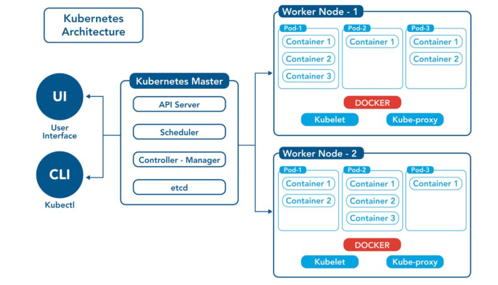
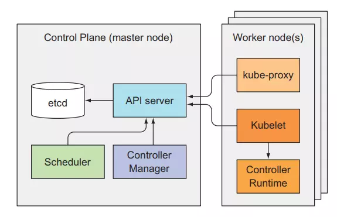

# Kubernetes-tutorial
Trang chủ kubernetes
- https://kubernetes.io/docs/home/

Tài liệu tiếng việt: https://viblo.asia/p/kubernetes-series-bai-11-kubernetes-internals-architecture-L4x5xPjb5BM
## 1. Kubernetes là gì? 
- Kubernetes (hay k8s) là một nền tảng open-source được dùng để chạy, quản lý, điều phối các ứng dụng được container hóa container và được phát triển bởi google. 
- Có thể dùng kubernetes để phát triển ứng dụng trên nhiều nền tảng khác nhau như on-premise, cloud, or virtual machines.
- Bạn có thể điều chỉnh tăng giảm tài nguyên, bản chạy phục vụ cho dịch vụ (scale), bạn có thể cập nhật (update), thu hồi update khi có vấn đề... 
- ==> hạn chế thời gian downtime của ứng dụng, Tối ưu hóa được tài nguyên hệ thống.
- Kubernetes cho phép chúng ta group và quản lý container theo ứng dụng và project, nó cũng cung cấp tính năng Service Discovery and Load Balancing để chúng ta có thể dẫn request của ứng dụng tới đúng container, và cũng có tính năng giúp ứng dụng của chúng ta high available nhất có thể, khi một server vật lý gặp sự cố, nó có thể chuyển container của ta sang server vật lý khác. 
- Ngoài ra kubernetes còn nhiều tính năng khác như: auto scale resource, auto restart application when failure, zero downtime deployment, automated rollouts and rollbacks application, v...v...

## 2. Kiến trúc của Kubernetes 
### ★　Kubernetes cluster (một cụm bao gồm một master và một hoặc nhiều worker) bao gồm 2 thành phần (component) chính:
  -    `Master nodes` (control plane)
  -    `Worker nodes`

### `Master nodes` (control plane)：
  Master node chỉ có nhiệm vụ điều khiển toàn bộ các hoạt động chung và kiểm soát các container của cluster, nó không có chạy ứng dụng trên đó, ứng dụng của chúng ta sẽ được chạy trên worker node. 
  Master nodes bao gồm 4 thành phần chính (4 thành phần này chạy chính là 4 container chạy trên master):
  
#### `API-server`
- API server là thành phần tiếp nhận yêu cầu của hệ thống K8S thông qua REST, tức là nó tiếp nhận các chỉ thị từ người dùng cho đến các services trong hệ thống Cluster thông qua API - có nghĩa là người dùng hoặc các service khác trong cụm cluster có thể tương tác tới K8S thông qua HTTP/HTTPS.

- API-server hoạt động trên port 6443 (HTTPS) và 8080 (HTTP).
- API-server nằm trên node master.
  
#### `Scheduler`

kube-scheduler có nhiệm vụ kiểm soát tài nguyên của tất cả các node để lựa chọn ra các node mỗi khi có yêu cầu tạo pod. Nó sẽ lựa chọn các node sao cho phù hợp nhất dựa vào các cơ chế lập lịch mà nó có. Kube-scheduler được cài đặt trên node master và sử dụng port 10251.

#### `Controller-manager`
- Thành phần controller-manager là thành phần quản lý trong K8S, nó có nhiệm vụ xử lý các tác vụ trong cụm cluster để đảm bảo hoạt động của các tài nguyên trong cụm cluster. Controller-manager có các thành phần bên trong như sau:

  - Node Controller: Tiếp nhận và trả lời các thông báo khi có một node bị down.
  - Replication Controller: Đảm bảo các công việc duy trì chính xác số lượng bản replicate và phân phối các container trong pod (Pod tạm hình dung là một tập hợp các container khi người dùng có nhu cầu tạo ra và cùng thực hiện chạy một ứng dụng).
  - Endpoints Controller: Populates the Endpoints object (i.e., join Services & Pods).
  - Service Account & Token Controllers:  Tạo ra các accounts và token để có thể sử dụng được các API cho các namespaces.

- Thành phần controller-manager hoạt động trên node master và sử dụng port 10252.

    
#### `etcd`
- Etcd là một CSDL dạng key-value được dùng để lưu dữ liệu của kubenetes cluster. Các dữ liệu này là dữ liệu quản lý tài nguyên của k8s như: thông tin node, pod, service, deployment, configmap... 
- Ectd nằm trên node master.

  
#### ★　 `Worker node`：
  Là nơi chạy các ứng dụng. Gồm 3 thành phần chính: 
 
`Container runtime` (docker, CRI-O, containerd hoặc nền tảng khác):chạy container

`Kubelet`: đóng vai trò như một agent trên mỗi nút (node) trong cluster. Nó chịu trách nhiệm quản lý và điều phối các container chạy trên nút đó. 

- Quản lý Pod: Kubelet giám sát trạng thái của các Pod (một hoặc nhiều container cùng chạy trên cùng một nút) và đảm bảo rằng chúng hoạt động theo định nghĩa trong các manifest YAML.
- Giao tiếp với API Server: Kubelet giao tiếp với API server của Kubernetes để nhận thông tin về các Pod, cập nhật trạng thái và báo cáo thông tin về các container đang chạy.
- Chạy các container: Kubelet sử dụng một container runtime (như Docker, CRI-O, containerd) để chạy và quản lý lifecycle của các container.
- Health checks: Kubelet thực hiện các health checks để xác định xem các container trong Pod có đang hoạt động tốt hay không. Nếu một container bị lỗi, Kubelet có thể khởi động lại nó.
- Tài nguyên: Kubelet thu thập và báo cáo thông tin về tài nguyên hệ thống, chẳng hạn như CPU và bộ nhớ, giúp Kubernetes quản lý tài nguyên tốt hơn. 

`Kubernetes Service Proxy (kube-proxy)`: quản lý network và traffic của các ứng dụng trong woker node

## 3. Cài đặt
  Bạn phải cài đặt các packages sau đây trên tất cả các node.
- `Container runtime` (cri-o)
- `kubelet`   : component chạy trên tất cả các máy trong Cluster và thực hiện những việc như khởi động pods và container
- `kubectl`   : giao tiếp với cluster qua các câu lệnh
- `kubeadm`   : lệnh để khởi động cluster

[installation-tutorial](./files/13_installation/chap13_Installation.txt)

    

★ Note: Nếu bạn dự định chạy 1 Kubernetes cluster trên laptop (locally), bạn cần phải có 1 tool được cài đặt trước giống như là  Minikube và sau đó re-run the commands kubectl cluster-info.
Cài đặt minikube 
https://minikube.sigs.k8s.io/docs/start/

★ Nếu lỗi xuất hiện "validate service connection: CRI v1 runtime API is not implemented for endpoint \"unix:///var/run/containerd/containerd.sock\": rpc error: code = Unimplemented desc = unknown service runtime.v1.RuntimeService " 
=> rm /etc/containerd/config.toml
systemctl restart containerd
kubeadm init

